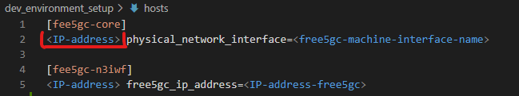
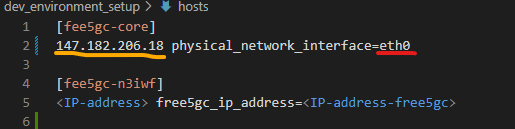
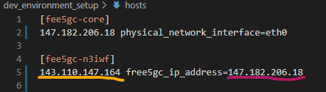

# UE-non3GPP
User Equipment for non-3GPP access via N3IWF | Working in-progress

### Environment
The content described in this repository was tested on 3 VM's in the [Digital Occean](https://www.digitalocean.com/) cloud environment [ ]1º VM representing UE-non3GPP, 2º VM where free5GC will run (except N3IWF) and 3º VM where the N3IWF ], each of them with the following configurations:
* SO: Ubuntu 20.04 (LTS) x64
* Uname -r: 5.4.0-122-generic
* Memory: 8 GB
* Disk: 80 GB

#### Before starting
The development environment setup is exec by Ansible. Before starting it is necessary to access via SSH each one of the VM's and execute the following command to install  __python + git + ansible__.
```
sudo apt update && apt -y install python && sudo apt -y install git && sudo apt -y install ansible
```

### Dev Environment Setup
The entire configuration process is done from the VM that represents ```UE-non3Gpp```, which needs to have full access to the other 2 VM's (free5GC and N3IWF). This is done through an SSH key exchange, as described in the following steps:
* Access the VM representing UE-non3GPP and generate an SSH key as described in the following command:
```
ssh-keygen -t ecdsa -b 521
```
obs: after executing the command, press ENTER 3x.

* After generating the key, we will copy and install the key in the VM that represents free5GC. To do this, just replace the ```<free5gc-ip-address>``` marker in the command below with the IP address of the machine that represents free5GC:
```
ssh-copy-id -i ~/.ssh/id_ecdsa.pub root@<free5gc-ip-address>
```

* The same procedure must be performed on the VM that represents the N3IWF, let's copy and install the key, replacing the marker ```<n3iwf-ip-address>``` in the command below with the IP address of the machine that represents the N3IWF:
```
ssh-copy-id -i ~/.ssh/id_ecdsa.pub root@<n3iwf-ip-address>
```

## UE-non3GPP VM Config
After creating the VM for UE-non3GPP, access via SSH and clone the project with the following command:
```
apt update && git clone https://github.com/LABORA-INF-UFG/UE-non3GPP.git 
```

After cloning the project, you need to edit the **hosts** file, located in the __UE-non3GPP/dev_environment_setup__ . The __host__ file contains 2 mapped hosts (n3IWF and free5GC). For each of them we must inform some configuration parameters. Let's start with the settings of the host responsible for running free5gc (except N3IWF). 
* Replace the marker ```<IP-address>``` with the IP address of the VM where free5GC will be configured (except N3IWF) as shown in the figure below.
<p align="center">
     
</p>

* Access the VM where free5GC will be configured, run ```ifconfig``` and get the name of **internet network interface**, like as illustrated in the figure below:
<p align="center">
     
</p>
replace the ```<free5gc-machine-interface-name>``` tag with the name of the network interface that provides internet access, as illustrated below:
<p align="center">
     
</p>

Now let's configure the N3IWF installation parameters. Still in the hosts file, but now in ```[fee5gc-n3iwf]```; replace the ```<IP-address>``` marker with the IP address of the machine where the N3IWF will be executed (highlighted in yellow in the following figure) and the ```<IP-address-free5gc>``` marker with the IP address of the machine where free5gc was configured (same IP address informed in the ```<IP-address>``` parameter of the host ```[fee5gc-core]``` in the line above).
<p align="center">
     
</p>

### Test Ansible Connection
Now let's test the Ansible connection with the respective hosts configured in the previous steps. In the terminal, inside the ```UE-non3GPP/dev_environment_setup``` directory, run the following command:
```
ansible -i ./hosts -m ping all -u root
```

### Go Install eith Ansible
The command below installs GO v.1.14 on each of VMs
```
ansible-playbook dev_environment_setup/go-install.yaml -i dev_environment_setup/hosts
```
Now it is necessary to access each of the VMs and update bashrc
```
source ~/.bashrc
```

### Run Ansible Free5GC and N3IWF Setup
Now let's run the script responsible for configuring free5gc (except the N3IWF network function) and a version of free5gc containing only the N3IWF network function
```
ansible-playbook dev_environment_setup/free5gc-n3iwf-setup.yaml -i dev_environment_setup/hosts
```

### Run Ansible UE-non3GPP Setup
Now let's run the script that configures the UE-non3GPP code, with all the interconnection configuration with the other 2 VMs
```
ansible-playbook dev_environment_setup/UEnon3GPP-setup.yaml -i dev_environment_setup/hosts
```